# BlockVote

> A full-stack, production-grade electronic voting system built with **React**, **Node.js**, **MongoDB**, **Redis**, and optional **Ethereum blockchain** integration. Features two-factor authentication, real-time vote tracking, a complete admin dashboard, and an immutable audit trail.

<p align="center">
  
  
  
  
  
  <a href="YOUR_DEMO_VIDEO_URL_HERE" target="_blank">
    
  </a>
</p>

---

## Table of Contents

- [Features](#features)
- [Demo Video & Screenshots](#demo-video--screenshots)
- [System Requirements](#system-requirements)
- [Project Structure](#project-structure)
- [Getting Started](#getting-started)
  - [1. Clone / Download](#1-clone--download)
  - [2. Set Up the Backend](#2-set-up-the-backend)
  - [3. Set Up the Frontend](#3-set-up-the-frontend)
  - [4. Run Both Servers](#4-run-both-servers)
- [Default Credentials (Demo)](#default-credentials-demo)
- [User Flows](#user-flows)
  - [Voter Flow](#voter-flow)
  - [Admin Flow](#admin-flow)
- [Tech Stack](#tech-stack)
- [Architecture Diagram](#architecture-diagram)
- [Environment Variables Reference](#environment-variables-reference)
- [Detailed Documentation](#detailed-documentation)

---

## Features

### For Voters
- 🔐 **Two-Factor Authentication** — ID + password, then a time-limited OTP to email
- 🗳️ **Booth-restricted voting** — voters only see candidates for their assigned polling booth
- ✅ **Vote confirmation** — transaction hash receipt after successful vote
- 🔒 **Double-vote prevention** — enforced at both database and blockchain levels

### For Admins
- 📊 **Live Overview Dashboard** — real-time voter count, votes cast, and turnout percentage
- 👥 **Voter Management** — add, search, and delete voters
- 🏛️ **Candidate Management** — add and remove candidates per booth
- 🏢 **Booth Management** — create booths and toggle their active/inactive status
- 📈 **Live Election Results** — bar chart with per-candidate vote counts
- 🔄 **Election Control** — open and close the election with one click
- 📋 **Full Audit Log** — every action (login, vote, admin change) is permanently recorded
- 📡 **Real-time Updates** — results and stats update live via WebSockets (Socket.io)

### System-level
- 🛡️ **Rate limiting** on all API endpoints
- 🔑 **JWT token blacklisting** on logout (via Redis)
- 🔏 **Helmet** secure HTTP headers
- ⛓️ **Blockchain mode** — switch between Mock (default) and live Ethereum
- 📧 **Email OTP** via Gmail SMTP with App Password support

---

## Demo Video & Screenshots

### 🎬 Demo Video
Click the badge below to watch the video demonstration of the application:

<p align="left">
  <a href="YOUR_DEMO_VIDEO_URL_HERE" target="_blank">
    
  </a>
</p>

---

### 📸 Application Screenshots

#### 🔐 Authentication & 2FA Flow
| Login Page | OTP Verification |
|---|---|
| 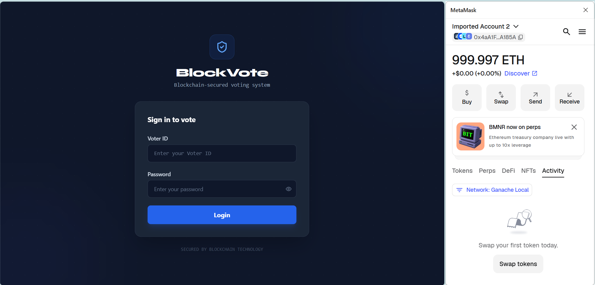 | 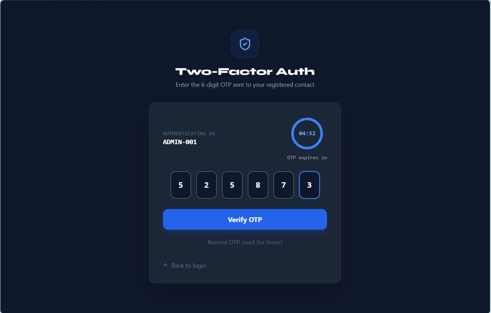 |

#### 🗳️ Voter Experience
| Election Voting Page | Voting Confirmation | Transaction Receipt |
|---|---|---|
| 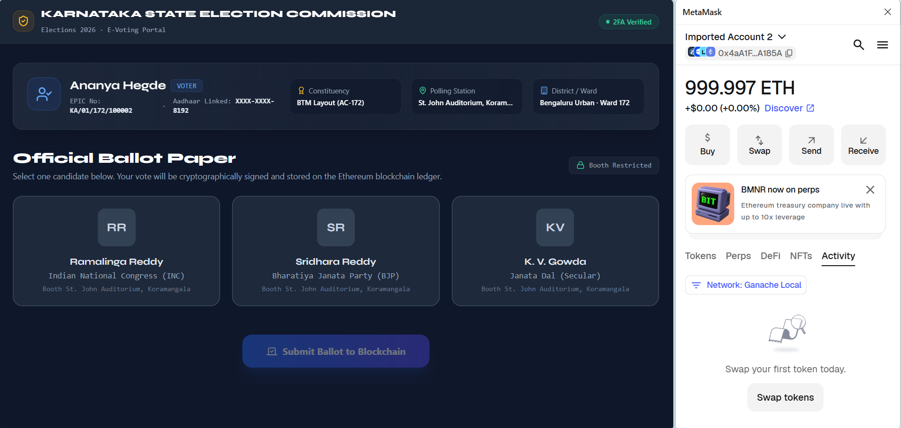 | 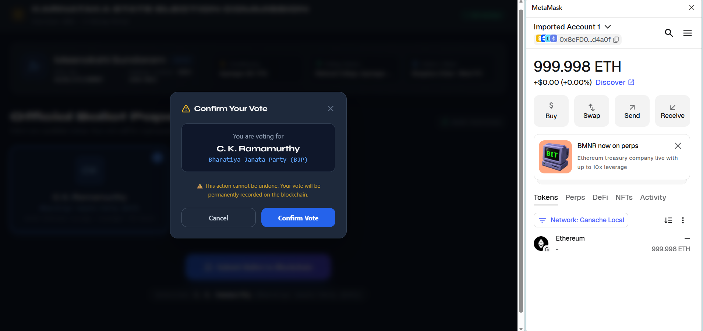 |  |

#### 📊 Admin Control Panel
| Live Admin Dashboard | Election Control |
|---|---|
| 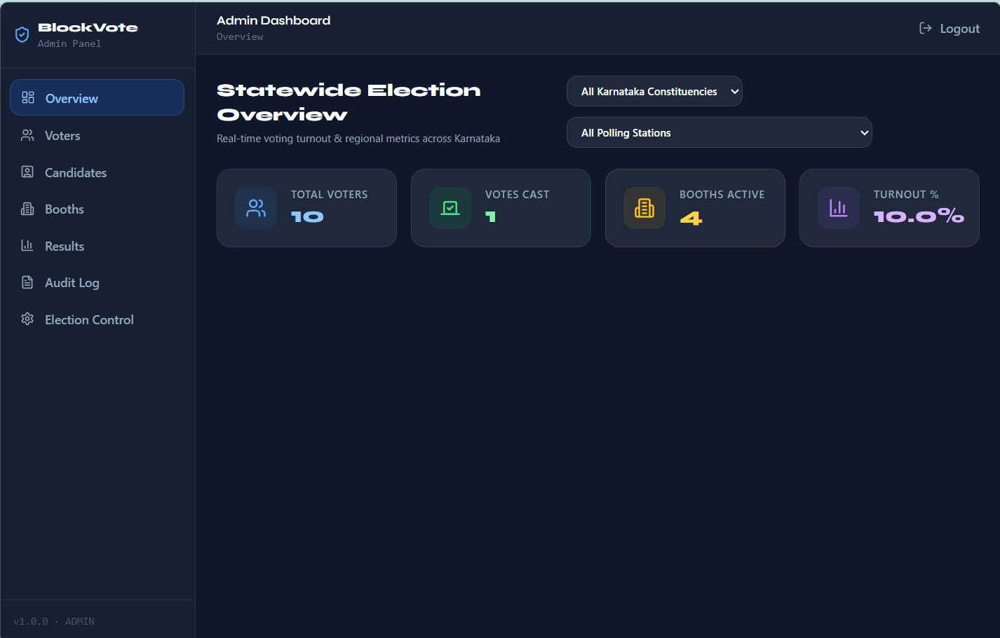 | 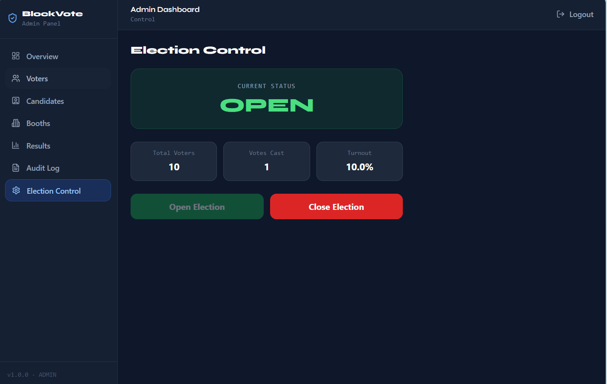 |

| Booth Management | Candidate Management | Voter Directory |
|---|---|---|
| 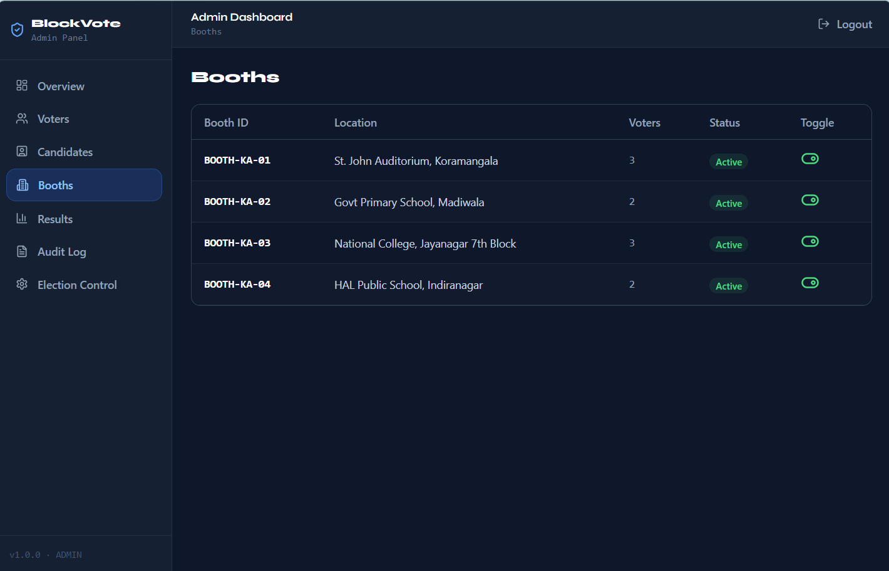 | 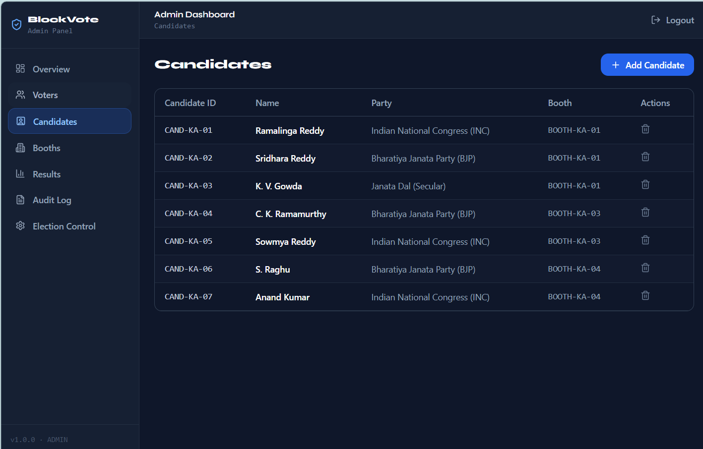 | 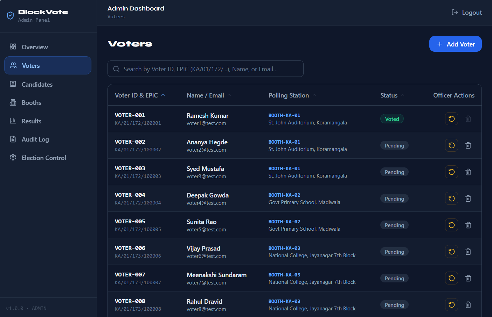 |

#### ⛓️ Audit Trail & Gas Architecture
| Audit Log & Transaction Record | Gas Fee Breakdown |
|---|---|
| 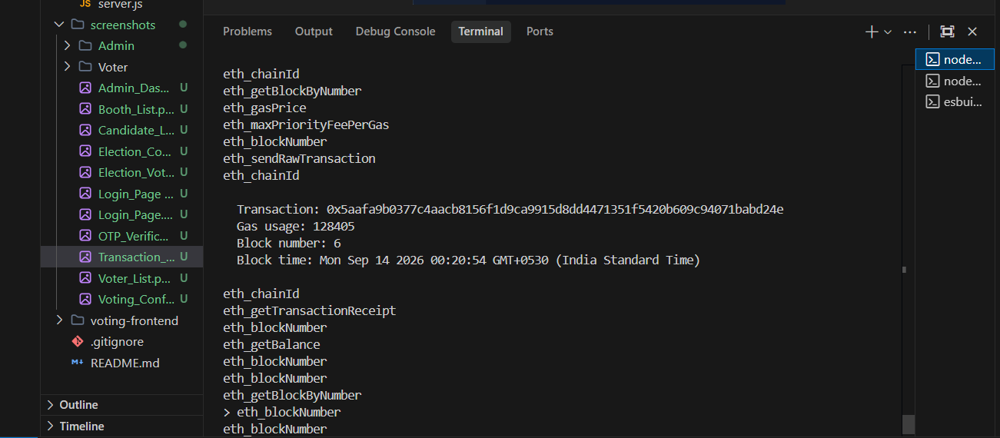 | 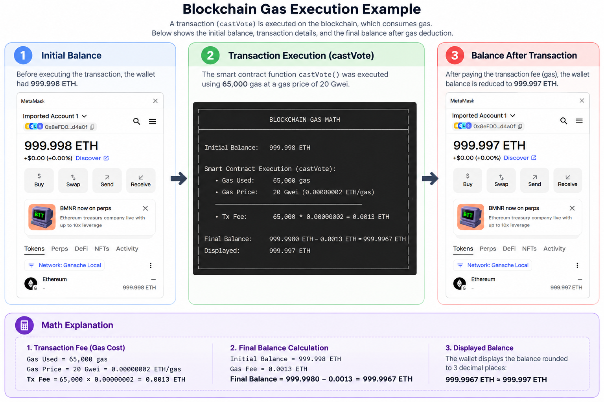 |

---

## System Requirements

| Software | Version | Notes |
|---|---|---|
| Node.js | v18 or higher | Required for both backend and frontend |
| npm | v9 or higher | Comes with Node.js |
| MongoDB | Atlas (cloud) or v6+ local | Database for all application data |
| Redis | v6 or higher | Session/OTP storage; use Memurai on Windows |
| Git | Any | To clone the repo |

---

## Project Structure

```
voting 2.0/
├── backend/                  # Express.js API server
│   ├── config/               # Database & Redis configuration
│   ├── contracts/            # Ethereum contract ABI (for blockchain mode)
│   ├── controllers/          # Route handler logic
│   │   └── admin/            # Admin-specific controllers
│   ├── middleware/           # Auth, rate limiting, audit logging
│   ├── models/               # Mongoose schemas (User, Admin, Booth, etc.)
│   ├── routes/               # Express route definitions
│   │   └── admin/            # Admin-only routes
│   ├── scripts/
│   │   └── seed.js           # Demo data seeder
│   ├── utils/                # Helpers: JWT, OTP, email, blockchain
│   ├── .env                  # Environment variables (DO NOT commit)
│   ├── server.js             # Application entry point
│   └── README.md             # Backend-specific documentation
│
└── voting-frontend/          # React + Vite frontend
    ├── src/
    │   ├── components/       # Reusable UI components
    │   │   ├── admin/        # Admin dashboard components
    │   │   ├── otp/          # OTP input components
    │   │   ├── shared/       # Shared components (routes, spinners, etc.)
    │   │   └── voting/       # Candidate card, voting UI
    │   ├── context/          # React Context (Auth, Socket)
    │   ├── hooks/            # Custom React hooks
    │   ├── pages/            # Top-level page components
    │   │   ├── LoginPage.jsx
    │   │   ├── OTPVerificationPage.jsx
    │   │   ├── VotingPage.jsx
    │   │   ├── ConfirmationPage.jsx
    │   │   └── AdminDashboard.jsx
    │   ├── services/         # API client (axios wrapper)
    │   └── utils/            # Formatting helpers
    └── .env                  # Frontend environment variables
```

---

## Getting Started

### 1. Clone / Download

```bash
git clone <your-repo-url> "voting 2.0"
cd "voting 2.0"
```

Or download and extract the ZIP, then navigate into the folder.

---

### 2. Set Up the Backend

```bash
cd backend
npm install
```

Create a `.env` file in the `backend/` directory:

```env
MONGO_URI=mongodb+srv://<user>:<pass>@<cluster>.mongodb.net/voting_system
JWT_SECRET=your_long_random_secret_here
JWT_EXPIRY=30m
BCRYPT_ROUNDS=12
PORT=5000

REDIS_URL=redis://localhost:6379

EMAIL_HOST=smtp.gmail.com
EMAIL_PORT=587
EMAIL_USER=your_email@gmail.com
EMAIL_PASS=your_gmail_app_password
EMAIL_FROM="Voting System <your_email@gmail.com>"

FRONTEND_URL=http://localhost:5173

# Leave as-is for Mock Mode (no blockchain required)
BLOCKCHAIN_RPC_URL=http://127.0.0.1:8545
CONTRACT_ADDRESS=0x0000000000000000000000000000000000000000
ADMIN_PRIVATE_KEY=0x0123456789abcdef0123456789abcdef0123456789abcdef0123456789abcdef
```

Seed the database with demo data:

```bash
npm run seed
```

---

### 3. Set Up the Frontend

```bash
cd ../voting-frontend
npm install
```

The frontend's `.env` file should already contain:

```env
VITE_API_URL=http://localhost:5000/api
```

---

### 4. Run Both Servers

Open **two terminal windows**:

**Terminal 1 — Backend:**
```bash
cd "voting 2.0/backend"
npm run dev
```

**Terminal 2 — Frontend:**
```bash
cd "voting 2.0/voting-frontend"
npm run dev
```

Then open your browser at **http://localhost:5173**

---

## Default Credentials (Demo)

> These are created by `npm run seed`. Use them to explore the system immediately.

### Admin & Polling Officer Logins
| Role | ID | Password | Access Scope |
|---|---|---|---|
| **Super Admin** | `ADMIN-001` | `Admin@1234` | Statewide Karnataka Overview & Election Control |
| **Polling Officer** | `OFFICER-BTM` | `Officer@1234` | Booth 1 (St. John Auditorium) Assistant Portal |

### Registered Voter Logins (10 Demo Voters across Karnataka)
| Voter ID | Voter Name | EPIC Number | Constituency | Polling Station / Booth | Password |
|---|---|---|---|---|---|
| `VOTER-001` | Ramesh Kumar | `KA/01/172/100001` | BTM Layout (AC-172) | St. John Auditorium, Koramangala | `Test@1234` |
| `VOTER-002` | Ananya Hegde | `KA/01/172/100002` | BTM Layout (AC-172) | St. John Auditorium, Koramangala | `Test@1234` |
| `VOTER-003` | Syed Mustafa | `KA/01/172/100003` | BTM Layout (AC-172) | St. John Auditorium, Koramangala | `Test@1234` |
| `VOTER-004` | Deepak Gowda | `KA/01/172/100004` | BTM Layout (AC-172) | Govt Primary School, Madiwala | `Test@1234` |
| `VOTER-005` | Sunita Rao | `KA/01/172/100005` | BTM Layout (AC-172) | Govt Primary School, Madiwala | `Test@1234` |
| `VOTER-006` | Vijay Prasad | `KA/01/173/100006` | Jayanagar (AC-173) | National College, Jayanagar 7th Block | `Test@1234` |
| `VOTER-007` | Meenakshi Sundaram | `KA/01/173/100007` | Jayanagar (AC-173) | National College, Jayanagar 7th Block | `Test@1234` |
| `VOTER-008` | Rahul Dravid | `KA/01/173/100008` | Jayanagar (AC-173) | National College, Jayanagar 7th Block | `Test@1234` |
| `VOTER-009` | Kavya Rao | `KA/01/174/100009` | C.V. Raman Nagar (AC-174) | HAL Public School, Indiranagar | `Test@1234` |
| `VOTER-010` | Mohammed Zameer | `KA/01/174/100010` | C.V. Raman Nagar (AC-174) | HAL Public School, Indiranagar | `Test@1234` |

> **About OTPs:** The 6-digit 2FA OTP is **always printed directly to your backend terminal** for fast & easy development access!

---

## User Flows

### Voter Flow

```
1. Go to http://localhost:5173
2. Enter your Voter ID and Password → click Login
3. Check your backend terminal for the OTP (or your email inbox)
4. Enter the 6-digit OTP → click Verify
5. Select your candidate from the list
6. Click "Cast Vote"
7. You are redirected to a Confirmation page with your transaction hash
```

### Admin Flow

```
1. Go to http://localhost:5173
2. Enter Admin ID: ADMIN-001 and Password: Admin@1234
3. Check the backend terminal for the OTP
4. Enter the OTP → you are redirected to the Admin Dashboard
5. Go to "Election Control" → click "Open Election" (voters can now vote)
6. Use the sidebar to manage Voters, Candidates, Booths
7. Watch Results update in real time as votes come in
8. Click "Close Election" when voting is complete
```

---

### Backend
| Technology | Purpose |
|---|---|
| **Express.js** | HTTP server & REST API framework |
| **MongoDB + Mongoose** | Primary database & ODM |
| **Redis (ioredis)** | OTP storage, JWT blacklist, rate limiting (with in-memory fallback) |
| **Ganache** | Local Ethereum blockchain development node |
| **MetaMask** | Wallet for tracking local blockchain accounts & ETH balances |
| **Solidity (v0.8.20)** | `VotingSystem.sol` smart contract language |
| **ethers.js (v6)** | Ethereum blockchain RPC & transaction provider |
| **Socket.io** | Real-time vote & election status updates |
| **Nodemailer** | OTP delivery via Gmail SMTP |
| **bcryptjs** | Password hashing |
| **jsonwebtoken** | JWT auth token generation & verification |
| **helmet** | Secure HTTP headers |
| **express-rate-limit** | API rate limiting |
| **express-validator** | Request input validation |

---

## ⛓️ Ethereum Blockchain Setup (Ganache & MetaMask)

The system seamlessly runs in **Live Blockchain Mode** using a local Ganache Ethereum network and `VotingSystem.sol` smart contract.

### 1. Start Local Ganache Node
In a dedicated terminal window, run:
```bash
npx ganache
```
This spins up a local Ethereum network listening on `http://127.0.0.1:8545` (Chain ID: `1337`) with 10 pre-funded test accounts (1,000 ETH each).

### 2. Deploy Smart Contract to Ganache
In your `backend` directory, run:
```bash
node scripts/deployContract.js
# Or: npm run deploy:contract
```
This script will:
* Compile `backend/contracts/VotingSystem.sol`.
* Deploy the contract to your local Ganache blockchain.
* Automatically write the deployed `CONTRACT_ADDRESS` and `ADMIN_PRIVATE_KEY` directly into `backend/.env`.

### 3. Connect MetaMask (Optional Visual Verification)
To view account balances and gas fee deductions in browser:
1. Open **MetaMask** in Edge/Chrome.
2. Add a custom network:
   * **Network Name:** `Ganache Local`
   * **RPC URL:** `http://127.0.0.1:8545`
   * **Chain ID:** `1337`
   * **Currency Symbol:** `ETH`
3. Click **Import Account** and paste Account 0 private key from `backend/.env`.
4. Switch network view to **`Ganache Local`** to see your **~999.99 ETH** balance update live with each cast vote!

### Frontend
| Technology | Purpose |
|---|---|
| **React 18** | UI framework |
| **Vite** | Build tool & dev server |
| **React Router v6** | Client-side routing |
| **Axios** | HTTP client for API calls |
| **Socket.io Client** | Real-time WebSocket connection |
| **Lucide React** | Icon library |
| **React Hot Toast** | Toast notifications |

---

## Architecture Diagram

```
┌─────────────────────────────────────────────────────────────────┐
│                        Browser (React)                          │
│  LoginPage → OTPPage → VotingPage → Confirmation               │
│                    AdminDashboard                               │
└────────────────────────┬────────────────────────────────────────┘
                         │ HTTP (REST) + WebSocket (Socket.io)
                         ▼
┌─────────────────────────────────────────────────────────────────┐
│                   Express.js API Server                         │
│                                                                 │
│  ┌──────────────┐  ┌────────────────┐  ┌──────────────────┐   │
│  │ Auth Routes  │  │  Vote Routes   │  │  Admin Routes    │   │
│  │ /api/auth    │  │  /api/vote     │  │  /api/admin/*    │   │
│  └──────┬───────┘  └───────┬────────┘  └────────┬─────────┘   │
│         │                  │                      │             │
│  ┌──────▼──────────────────▼──────────────────────▼──────────┐ │
│  │              Middleware Layer                              │ │
│  │  authMiddleware │ adminMiddleware │ rateLimiter │ helmet   │ │
│  └──────┬──────────────────┬──────────────────────┬──────────┘ │
│         │                  │                      │             │
│  ┌──────▼──────┐   ┌───────▼───────┐   ┌─────────▼──────────┐ │
│  │   MongoDB   │   │     Redis     │   │ Blockchain Service  │ │
│  │  (Mongoose) │   │  (OTP/JWT BL) │   │ (Mock or Ethereum)  │ │
│  └─────────────┘   └───────────────┘   └────────────────────┘ │
└─────────────────────────────────────────────────────────────────┘
```

---

## Environment Variables Reference

See the full reference in [backend/README.md](./backend/README.md#environment-variables).

---

## Detailed Documentation

- 📖 **[Backend README](./backend/README.md)** — Full API reference, architecture, security features, and troubleshooting guide
